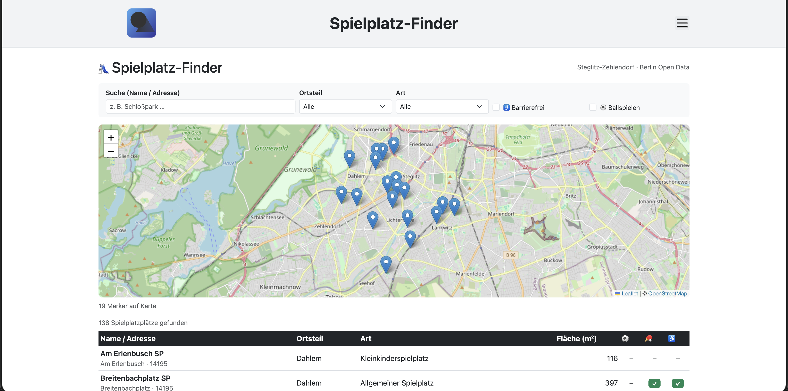
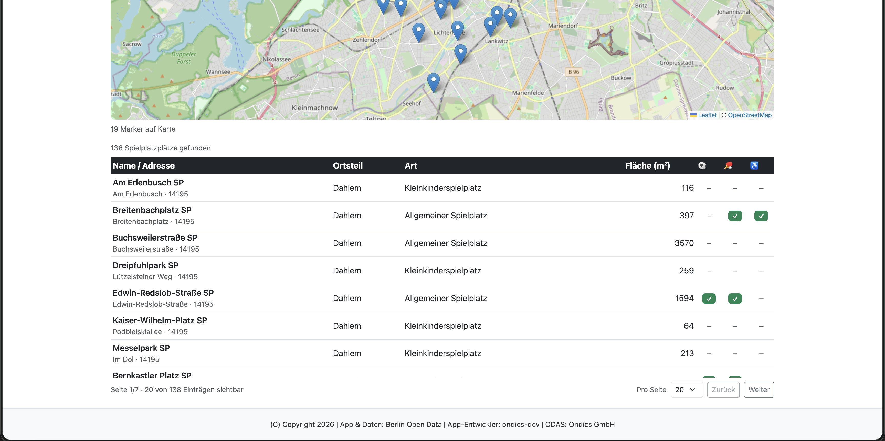

# Spielplätze – App für den Open Data App-Store (ODAS)

Interaktive Visualisierung von Spielplatzdaten für den [Open Data App Store](https://open-data-app-store.de/). Entspricht der [Open Data App-Spezifikation](https://open-data-apps.github.io/open-data-app-docs/open-data-app-spezifikation/). Mehr unter https://github.com/open-data-apps

---

## Funktionen





Single Page Application mit Logo, Menü, Impressum/Datenschutz/Kontakt-Seiten und Fußzeile. Die Konfiguration wird vom ODAS geladen. Inhalte:

- Interaktive Kartenansicht mit Leaflet.js/OpenStreetMap
- Tabellenansicht der gefilterten Spielplätze
- Volltextsuche nach Name und Adresse
- Filter nach Ortsteil und Art
- Zusatzfilter für Barrierefreiheit und Ballspielen
- Ergebniszähler und Marker-Popups mit Kerndaten

---

## Datenformat

Unterstützt CSV aus Open-Data-Quellen.

- Delimiter-Erkennung für Semikolon und Komma
- Quote-sicheres Parsing inklusive Escaped-Quotes
- Verarbeitung von Proxy-Antworten als Rohtext oder JSON-Wrapper mit content-Feld

---

## Kompatible Datensätze

Spielplatz-Datensätze mit Geokoordinaten und optional variierenden Feldnamen. Die App normalisiert gängige Varianten automatisch.

| App-Feld       | Erwartete Inhalte | Unterstützte Feldnamen (Auszug)                      |
| -------------- | ----------------- | ---------------------------------------------------- |
| name           | Name/Adresse      | name, bezeichnung, adresse, strasse                  |
| ortsteil       | Ortsteil/Bezirk   | ortsteil, bezirk                                     |
| plz            | Postleitzahl      | plz, postleitzahl                                    |
| art            | Typ/Art           | art, spielplatzart, anlagenart                       |
| flaeche        | Fläche            | groesse, flaeche, größe                              |
| barrierefrei   | Barrierefrei-Flag | behindertengerecht, barrierefrei                     |
| ballspielen    | Ballspielen-Flag  | ballspielen, bolzen                                  |
| tischtennis    | Tischtennis-Flag  | tischtennis, tischtennis_anzahl                      |
| schliesszeiten | Zeiten            | schliesszeiten, öffnungszeiten                       |
| lat/lon        | Geokoordinaten    | lat/lon, latitude/longitude, breitengrad/laengengrad |

Hinweis: Boolesche Felder werden aktuell mit J als positiv ausgewertet.

---

## Für wen ist diese App?

Diese App hilft Familien, den passenden Spielplatz in Berlin zu finden. Filtern Sie nach Ortsteil, Ausstattung und Barrierefreiheit.

---

## Entwicklung

Voraussetzungen: Docker / Docker Compose, Make

```bash
make build up
```

App läuft lokal auf http://localhost:8090.

Konfiguration wird bei lokaler Entwicklung aus [odas-config/config.json](odas-config/config.json) geladen.

### Wichtige Dateien

| Datei                                                | Beschreibung                                                                               |
| ---------------------------------------------------- | ------------------------------------------------------------------------------------------ |
| [app/app.js](app/app.js)                             | Hauptlogik: Datenladen über Proxy/Fallback, CSV-Parsing, Filter, Tabelle und Leaflet-Karte |
| [app-package.json](app-package.json)                 | App-Metadaten und Instanz-Konfigurationsfelder für den ODAS                                |
| [assets/odas-app-icon.svg](assets/odas-app-icon.svg) | App-Icon                                                                                   |
| [odas-config/config.json](odas-config/config.json)   | Lokale Konfiguration für die Entwicklung                                                   |
| [docker-compose.yml](docker-compose.yml)             | Lokale Container-Orchestrierung (Nginx + Volumes)                                          |

---

## Konfiguration (Instanz)

| Parameter    | Beschreibung                               | Pflicht |
| ------------ | ------------------------------------------ | ------- |
| apiurls      | URLs zu Datenressourcen. Eintrag `spielplaetze`: direkte URL zur CSV-Ressource | ja (Eintrag `spielplaetze`) |
| urlDaten     | URL zur Datensatzseite im Open Data Portal | ja      |
| titel        | Titel in der App-Kopfzeile                 | ja      |
| seitentitel  | Browser-Tab-Titel                          | ja      |
| icon         | Icon in der Titelzeile                     | ja      |
| kontakt      | Inhalt der Kontaktseite (Markdown)         | ja      |
| beschreibung | Inhalt der Seite Über diese App (Markdown) | ja      |
| impressum    | Inhalt der Impressumsseite (Markdown)      | ja      |
| datenschutz  | Inhalt der Datenschutzseite (Markdown)     | ja      |
| fusszeile    | Text in der Fußzeile                       | ja      |
| sprache      | App-Sprache (de)                           | ja      |

---

## Technische Hinweise

- Datenabruf erfolgt direkt aus dem Browser gegen die konfigurierte `apiurls.spielplaetze`.
- Die konfigurierte Datenquelle muss CORS freigeben.

---

## Betriebsarten

Die App kann lokal, eigenstaendig hinter einem Traefik-Reverse-Proxy oder ueber den ODAS
betrieben werden.

### Datenabruf: kein `proxyAktiv`-Schalter

Der ODAS-Proxy wird derzeit umgebaut und funktioniert nach der aktuellen Host-Regel nicht
mit einer Fremdquelle wie `www.berlin.de` (der Host liegt ausserhalb des betreibenden ODP,
jeder `…/odp-data`-Aufruf scheitert mit HTTP 500 ohne Fallback). Das Umschaltfeld
`proxyAktiv` wird deshalb bewusst **nicht angeboten**; die App laedt ausschliesslich direkt
und setzt eine CORS-freigegebene Datenquelle voraus.

### Standalone-Betrieb

Voraussetzung: ein laufender Traefik mit dem externen Docker-Netzwerk `proxynet`,
dem EntryPoint `websecure` und dem Zertifikatsresolver `letsencrypt`.

1. In `docker-compose.standalone.yml` den Platzhalter `app1.example.com` durch den
   echten FQDN ersetzen.
2. Starten:

```bash
STANDALONE=true make up
STANDALONE=true make logs
STANDALONE=true make down
```

Im Standalone-Betrieb entfaellt die lokale Portfreigabe; Traefik terminiert TLS und
leitet auf den internen Nginx-Port 80 weiter. Die Konfiguration wird aus derselben
`odas-config/config.json` gelesen wie in der Entwicklung und von Nginx unter `/config`
ausgeliefert.

### Beim Aufruf kontaktierte Drittanbieter

Beim Aufruf dieser App werden folgende externe Server kontaktiert:

- `tile.openstreetmap.org` — Kartenkacheln (OpenStreetMap)
- `nominatim.openstreetmap.org` — Adress-Suche (Nominatim); übertragen: Adressbestandteile der Spielplätze ohne Koordinaten, IP-Adresse, User-Agent; Abruf nur bei fehlenden Koordinaten

Diese Anbieter bleiben auch im Standalone-Betrieb extern; ein vollständig autarker Betrieb ohne Internetzugang ist derzeit nicht möglich. Alle Programmbibliotheken werden lokal aus `app/vendor/` ausgeliefert und nicht mehr extern geladen.

### Auslieferung an den ODAS

`make zip` erzeugt das Liefer-ZIP mit `app/`, `assets/`, `app-package.json` und
`CHANGELOG.md`. Die Infrastrukturdateien (`Dockerfile`, `docker-compose*.yml`,
`nginx.conf`, `Makefile`) sind nicht Teil der Auslieferung. Das ZIP ist ein Bauartefakt und wird nicht mitversioniert, sondern bei Bedarf mit `make zip` erzeugt.

## Autor

© 2026, Ondics GmbH
